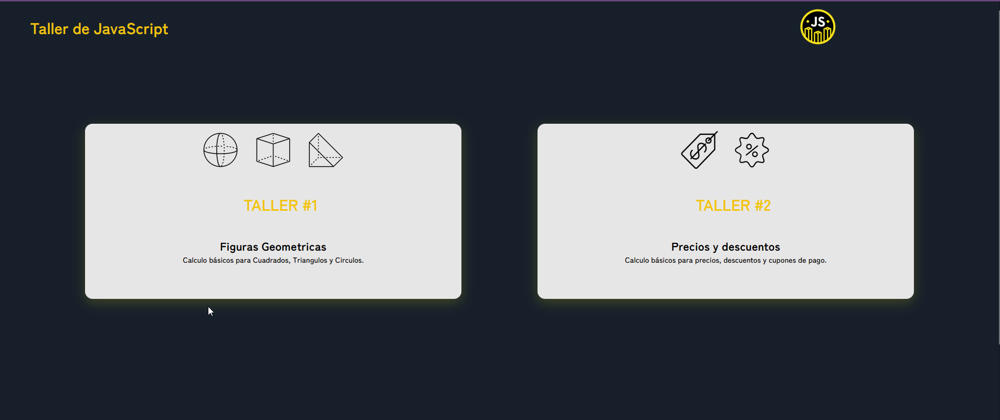

# curso-practico-javascript
Curso de platzi de JavaScript

...

...
## Taller #1: Figuras Geométricas 

-Primer paso: definir las formulas 
-Segundo paso: Implementar las fórmulas en JavaScript
-Tercer paso: Crear funciones 
-Cuarto paso: integrar html con javaScript
## Taller #2: Porcentajes y descuentos  

-Primer paso: definir las formulas 
-Segundo paso: Implementar las fórmulas en JavaScript
-Tercer paso: Crear funciones 
-Cuarto paso: integrar html con javaScript

## Taller #3: Promedio, mediana y moda   

-Primer paso: definir las formulas 
-Segundo paso: Implementar las fórmulas en JavaScript
-Tercer paso: Crear funciones 
-Cuarto paso: integrar html con javaScript
## Taller #4: Análisis de salarios 

-Primer paso: definir las formulas 
-Segundo paso: Implementar las fórmulas en JavaScript
-Tercer paso: Crear funciones 
-Cuarto paso: integrar html con javaScript